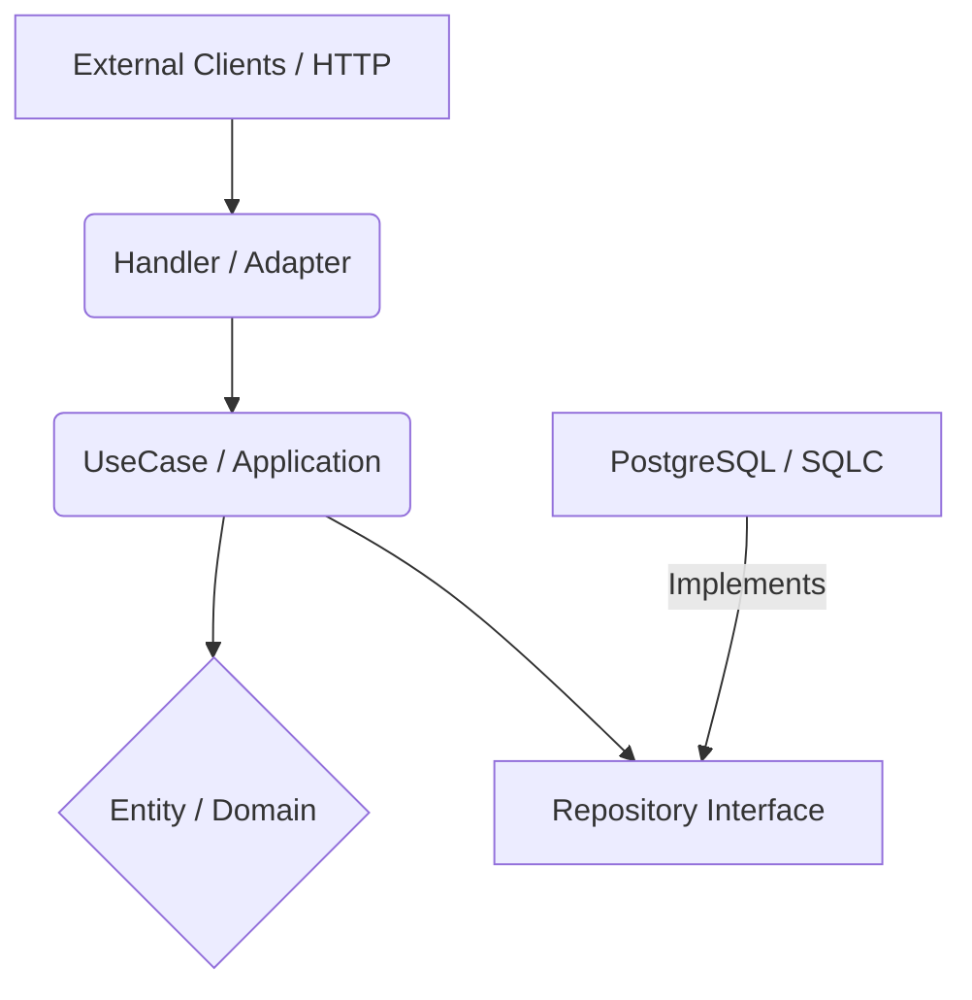

# 🚚 GoFleet

> **Sistema Distribuído de Gestão Logística e Entregas**

O **GoFleet** é um backend de alta performance desenvolvido em **Go**, focado em resolver problemas de logística como gestão de pedidos, despacho de motoristas e rastreamento em tempo real.

O projeto foi desenhado seguindo rigorosamente os princípios de **Clean Architecture** e **Domain-Driven Design (DDD)** para garantir desacoplamento, testabilidade e manutenibilidade.

## 🏗️ Arquitetura e Design

O projeto segue o padrão **Standard Go Project Layout** e a **Clean Architecture**. O fluxo de dependência aponta sempre para dentro (Domínio).



### Estrutura de Pastas

* `cmd/api`: Entrypoint da aplicação (Main).
* `internal/domain/entity`: O coração do software. Regras de negócio puras e invariantes.
* `internal/application`: Casos de uso (Orquestração).
* `internal/infra`: Implementações técnicas (Banco de dados, Web Server, Filas).
* `configs`: Gerenciamento de variáveis de ambiente.
* `sql`: Migrations e Queries SQL puras.

## 🛠️ Tech Stack

* **Linguagem:** Golang
* **Web Framework:** Chi (Router leve e idiomático)
* **Database:** PostgreSQL 15+
* **Data Access:** SQLC (Type-safe SQL compiler)
* **Configuração:** Viper
* **Infraestrutura:** Docker & Docker Compose
* *(Em breve)* **Mensageria:** RabbitMQ
* *(Em breve)* **Comunicação Interna:** gRPC

## 🚀 Como Rodar

### Pré-requisitos

* Go 1.21+
* Docker & Docker Compose
* Make (Opcional, mas recomendado)

### Passo a Passo

1. **Clone o repositório:**
```bash
git clone https://github.com/seu-usuario/gofleet.git
cd gofleet

```


2. **Suba a infraestrutura (Postgres & RabbitMQ):**
```bash
docker-compose up -d

```


3. **Configure o ambiente:**
   Certifique-se de que o arquivo `.env` existe na raiz (baseado no exemplo).
4. **Execute a aplicação:**
```bash
go run cmd/api/main.go

```


## 🔌 API Endpoints

### Orders

**Criar um novo Pedido**
`POST /orders`

```bash
curl -X POST http://localhost:8000/orders \
     -H "Content-Type: application/json" \
     -d '{
        "id": "abc-123",
        "price": 100.50,
        "tax": 10.0
     }'

```

**Resposta de Sucesso (200 OK):**

```json
{
  "id": "abc-123",
  "final_price": 110.5
}

```

## 📚 Roadmap de Desenvolvimento

Este projeto serve como base de estudo para trilhas avançadas de Go:

* [x] **Fase 1:** Setup, Clean Arch, DDD Entities e SQLC.
* [x] **Fase 2:** API REST com Chi, Context e DI Manual.
* [ ] **Fase 3:** Event-Driven Architecture com RabbitMQ (Async).
* [ ] **Fase 4:** Microsserviços e comunicação gRPC.
* [ ] **Fase 5:** CI/CD e Deploy com Docker Multistage.
