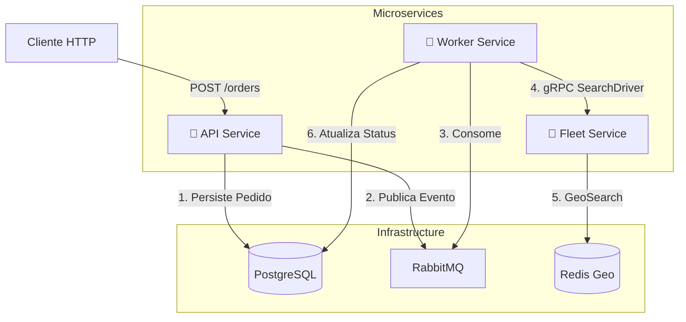
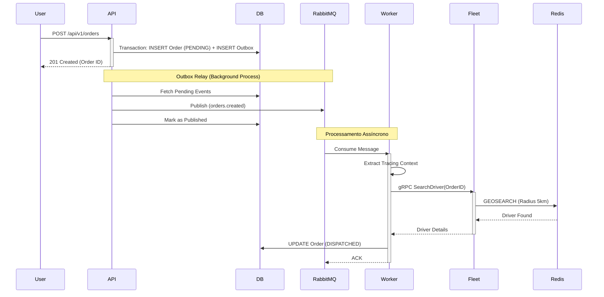
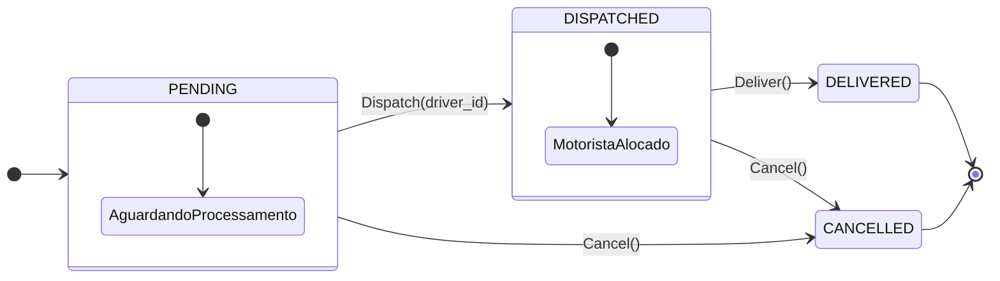
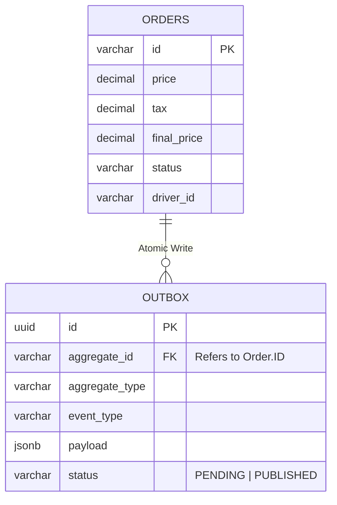
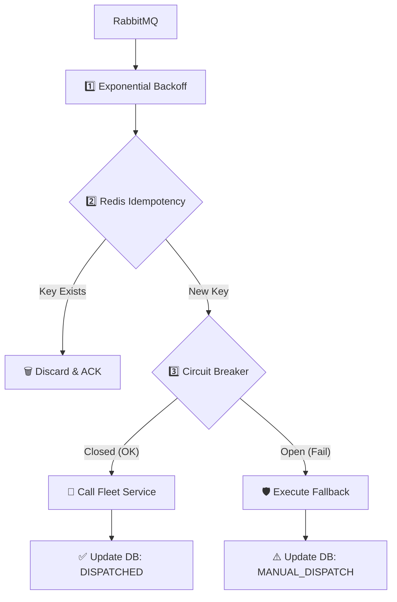

# 🚚 GoFleet


> **Sistema Distribuído de Logística e Despacho Cloud-Native**

O **GoFleet** é um backend de alta performance projetado como um laboratório de engenharia de software avançada. Ele simula uma plataforma de despacho de entregas (similar ao Uber/iFood), focando em **sistemas distribuídos**, **observabilidade completa** e **padrões de resiliência**.

O sistema orquestra a criação de pedidos via API REST, processamento assíncrono via filas, comunicação gRPC de baixa latência e busca geoespacial de motoristas.

---

## 🏗️ Arquitetura e Design

O sistema segue os princípios de **Clean Architecture** e **DDD**, organizado em um monorepo com três microsserviços distintos.

### 1. Visão Geral do Sistema (C4 Container Level)

Este diagrama ilustra como os serviços interagem com a infraestrutura.



### 2. Fluxo de Dados (Sequence Diagram)

O fluxo "Happy Path" de um pedido, demonstrando a natureza assíncrona e eventual do sistema.



---

## 🧩 Modelagem e Dados

Além da infraestrutura, o GoFleet utiliza modelagem rica para garantir a integridade das regras de negócio e a consistência dos dados distribuídos.

### Ciclo de Vida do Pedido (State Machine)

O domínio garante transições válidas via **State**, enquanto o banco de dados atua como última linha de defesa através de **CHECK constraints**, evitando estados inválidos mesmo em cenários de falha.”

Para evitar estados inválidos e garantir a segurança das transições (ex: um pedido cancelado não pode ser entregue), utilizamos o **State Pattern**. O diagrama abaixo ilustra a máquina de estados finita implementada no domínio:



### Consistência Eventual (Transactional Outbox)

Para resolver o problema de escrita dual (Dual Write) em sistemas distribuídos, não publicamos mensagens diretamente na fila. Em vez disso, persistimos o evento na mesma transação do banco de dados, garantindo atomicidade.



### 3. Controle de Concorrência e Integridade do Aggregate

Em um ambiente de alta escala, múltiplos processos podem tentar modificar o mesmo Aggregate (Pedido) simultaneamente (ex: um evento de "Cancelar" compete com um de "Despachar").

O sistema garante a consistência através de:

1.  **State Pattern como Guardião:**
    A lógica de domínio em memória atua como primeira barreira. Se um Worker carregar um pedido que já está `CANCELLED` e tentar executar `Dispatch()`, a Entidade retorna erro de regra de negócio imediatamente, abortando a transação antes da escrita.

2.  **Transações ACID:**
    Todas as mutações de estado e persistência de eventos (Outbox) ocorrem dentro de uma transação isolada do PostgreSQL, garantindo que a visão do agregado seja consistente durante a operação.

---

## 🛡️ Engenharia de Resiliência e Confiabilidade

O GoFleet implementa uma estratégia de defesa em profundidade (*Defense in Depth*) no `Worker Service`, combinando padrões para garantir consistência e alta disponibilidade.

### Pipeline de Processamento (Middleware Chain)

O diagrama abaixo ilustra a ordem exata das camadas de proteção aplicadas a cada mensagem recebida



### 1. Idempotência (Deduplicação)

Para garantir a semântica *Exactly-Once Processing* em cima do RabbitMQ (que garante *At-Least-Once*), implementamos um **Idempotency Guard** com Redis.

* **Como funciona:** Antes de processar, geramos um hash SHA-256 do payload e tentamos um `SETNX` no Redis.
* **Resultado:** Se a chave já existir, a mensagem é duplicada e descartada silenciosamente (Ack), protegendo o banco de dados de escritas redundantes.

### 2. Fallback e Degradação Graciosa

Se o serviço dependente (`Fleet Service`) estiver indisponível, o Circuit Breaker abre. Em vez de rejeitar a mensagem e travar a fila com infinitos retries (*Poison Message*), o sistema aplica uma estratégia de **Fallback de Negócio**:

* **Ação:** O pedido é capturado e movido para o estado `MANUAL_DISPATCH`.
* **Benefício:** O cliente não fica "preso" e a operação pode despachar o pedido manualmente, garantindo continuidade de negócio mesmo com falha na infraestrutura.

### 3. Circuit Breaker & Backoff

* **Sony Gobreaker:** Interrompe chamadas ao Fleet Service após 60% de falha, evitando efeito cascata.
* **Exponential Backoff:** Retentativas inteligentes (1s, 2s, 4s) para falhas transientes de rede.

### 4. Semântica de Entrega (At-Least-Once Delivery)

O sistema foi desenhado assumindo que **falhas ocorrerão** após o processamento mas antes da confirmação (ACK).

| Cenário de Falha                                | Comportamento do Sistema                                                                                                                                                                |
|:------------------------------------------------|:----------------------------------------------------------------------------------------------------------------------------------------------------------------------------------------|
| **Worker cai antes do DB Commit**               | RabbitMQ reenvia a mensagem. O novo Worker processa normalmente.                                                                                                                        |
| **Worker cai APÓS DB Commit, mas ANTES do ACK** | RabbitMQ reenvia a mensagem (At-Least-Once). O novo Worker tenta processar, mas é **bloqueado pelo Redis (Idempotency)** ou pela **Unique Constraint** do banco, enviando apenas o ACK. |

> **Garantia Final:** Nenhuma transição de estado ocorre mais de uma vez, mesmo sob falhas catastróficas do processo.


### 5. Backpressure e Controle de Carga

Para evitar que picos de tráfego derrubem os Workers por exaustão de memória (OOM), implementamos um mecanismo estrito de **Backpressure** direto no protocolo AMQP.

* **Prefetch Count (QoS):**
  O Worker limita a ingestão a **10 mensagens simultâneas** por instância.
   * *Como funciona:* O RabbitMQ cessa o envio de novas mensagens até que o Worker libere slots enviando `ACKs`.
   * *Resultado:* O sistema torna-se "elástico". Se o banco de dados ficar lento, o Worker processa mais devagar, o RabbitMQ segura as mensagens na fila, e a API continua aceitando pedidos sem cair.

---

## 👁️ Observabilidade Completa

O diferencial do GoFleet é a correlação total de dados. Um `TraceID` gerado na API viaja via headers AMQP até o Worker e via metadados gRPC até o Fleet.

### Stack de Observabilidade

* **Tracing:** OpenTelemetry (OTel) -> Jaeger.
* **Métricas:** Prometheus (exposto em `:2112/metrics`).
* **Logs:** Zap (JSON Estruturado) com injeção automática de `trace_id` e `span_id` -> Promtail -> Loki.
* **Visualização:** Grafana unificando tudo.

---

## 🛠️ Tecnologias e Bibliotecas

| Categoria          | Tecnologia            | Uso no Projeto                         |
|--------------------|-----------------------|----------------------------------------|
| **Linguagem**      | **Go 1.25**           | Core do sistema                        |
| **Framework HTTP** | **Chi v5**            | Router leve e idiomático               |
| **Comunicação**    | **gRPC + Protobuf**   | Comunicação interna (Worker -> Fleet)  |
| **Mensageria**     | **RabbitMQ**          | Desacoplamento de eventos              |
| **Database**       | **PostgreSQL + SQLC** | Persistência Type-Safe (Sem ORM)       |
| **Cache/Geo**      | **Redis**             | GeoSpatial Indexing para motoristas    |
| **Resiliência**    | **Sony Gobreaker**    | Circuit Breaker                        |
| **Config**         | **Viper**             | Gerenciamento de váriaveis de ambiente |
| **Tracing**        | **OpenTelemetry**     | Instrumentação manual e automática     |

---

---

## 📈 Service Level Objectives (SLOs)

Mais do que apenas coletar métricas, o GoFleet define objetivos claros de confiabilidade e performance que justificam as decisões arquiteturais (ex: uso de filas e circuit breakers).

| Serviço            | Indicador (SLI)                   | Objetivo (SLO) | Racional                                                                                              |
|:-------------------|:----------------------------------|:---------------|:------------------------------------------------------------------------------------------------------|
| **API Service**    | Latência de Ingestão (p95)        | **< 200ms**    | O cliente não deve esperar para "criar" o pedido. A complexidade pesada é delegada ao Worker.         |
| **API Service**    | Disponibilidade                   | **99.9%**      | A API deve aceitar pedidos mesmo se o RabbitMQ ou Fleet Service estiverem fora (fallback via Outbox). |
| **Worker Service** | Latência E2E (Create -> Dispatch) | **< 5s**       | Tempo máximo aceitável para o motorista ser alocado após o clique do usuário.                         |
| **Worker Service** | Taxa de Sucesso                   | **> 99.5%**    | Permite falhas transientes (retries), mas alerta se o Circuit Breaker abrir por muito tempo.          |

> **Nota:** Os dashboards do Grafana foram desenhados para monitorar a "saúde" desses SLOs, e não apenas consumo de CPU/Memória.

---

## 🚀 Como Executar

### Pré-requisitos

* Docker e Docker Compose
* Make (opcional, para usar os atalhos)
* Go 1.25+ (apenas se for rodar fora do Docker)

### Passo a Passo

1. **Subir o ecossistema:**
   O comando abaixo compila os binários, constrói as imagens Docker e sobe toda a infraestrutura (Bancos, Filas e Observabilidade).
```bash
make docker-up

```


2. **Acessar os Dashboards:**
* **Grafana:** [http://localhost:3000](https://www.google.com/search?q=http://localhost:3000) (User: `admin`, Pass: `admin`)
* **Jaeger UI:** [http://localhost:16686](https://www.google.com/search?q=http://localhost:16686)
* **Prometheus:** [http://localhost:9090](https://www.google.com/search?q=http://localhost:9090)
* **RabbitMQ:** [http://localhost:15672](https://www.google.com/search?q=http://localhost:15672) (guest/guest)


3. **Realizar um Teste (Criar Pedido):**
   Utilize o arquivo `orders.http` ou via cURL:
```bash
curl -X POST http://localhost:8000/api/v1/orders \
-H "Content-Type: application/json" \
-d '{"id":"pedido-teste-01", "price": 100.0, "tax": 10.0}'

```


4. **Verificar o Fluxo:**
* Verifique se o pedido foi criado no Postgres:
```bash
docker exec -it gofleet_db psql -U root -d gofleet -c "SELECT * FROM orders;"

```


* Vá ao **Jaeger**, selecione `gofleet-api` e procure pelos traces. Você verá a linha do tempo completa: API -> RabbitMQ -> Worker -> gRPC -> Redis.


---

## 🧠 Padrões de Código (Staff Engineer View)

Explicação de decisões técnicas encontradas no código fonte:

### 1. Decorator Pattern para Métricas

Local: `internal/application/usecase/order/create_metrics.go`

* **Por quê?** Separa a lógica de negócio (Use Case) da instrumentação.
* **Como?** O `CreateOrderMetricsDecorator` "envolve" o Use Case real. Ele mede o tempo de execução e incrementa contadores no Prometheus sem sujar a regra de negócio.

### 2. State Pattern

Local: `internal/domain/entity/states.go`

* **Por quê?** Evita condicionais complexas (`if status == "PENDING"`) e garante transições seguras.
* **Como?** Cada estado (Pending, Dispatched, Delivered) é uma struct que implementa a interface `OrderState`. Tentar entregar um pedido cancelado retorna erro automaticamente.

### 3. Interface Segregation (Ports & Adapters)

Local: `internal/application/port`

* **Por quê?** O domínio não conhece o banco de dados ou gRPC.
* **Como?** Os Use Cases dependem de interfaces (`OrderRepository`, `LocationRepository`). As implementações concretas (Postgres, Redis) estão na camada de `infra`.

### 4. Propagação de Contexto (Distributed Tracing)

Local: `internal/infra/event/consumer.go`

* **Por quê?** Não perder o rastro da requisição quando ela entra na fila.
* **Como?** Extraímos o `traceparent` dos headers da mensagem AMQP e injetamos no `context.Context` do Go. Isso liga o Span do `produtor` (API) ao Span do `consumidor` (Worker).

---

## 📂 Estrutura de Pastas

```text
.
├── cmd/                # Entrypoints (main.go)
│   ├── api/            # API REST
│   ├── fleet/          # Serviço gRPC de Geolocalização
│   └── worker/         # Processador de Filas
├── configs/            # Configuração (Viper)
├── internal/
│   ├── application/    # Camada de Aplicação
│   │   ├── usecase/    # Regras de Negócio + Decorators
│   │   └── port/       # Interfaces (Ports)
│   ├── domain/         # Core (Entidades, Eventos, States)
│   └── infra/          # Adaptadores de Infraestrutura
│       ├── database/   # Implementações SQLC e Redis
│       ├── event/      # RabbitMQ (Producer/Consumer)
│       ├── grpc/       # Implementação do Server/Client gRPC
│       └── web/        # Handlers HTTP
├── pkg/                # Packages compartilhados (Logger, Metrics, OTel)
└── sql/                # Migrations e Queries SQLC

```

---

---

## 🔧 Configuração (Environment Variables)

O sistema segue a metodologia **12-Factor App**, externalizando configurações via variáveis de ambiente. Abaixo estão as principais chaves definidas em `configs/configs.go`:

| Variável                      | Descrição                 | Valor Padrão (Dev) |
|-------------------------------|---------------------------|--------------------|
| `DB_HOST`                     | Host do PostgreSQL        | `localhost`        |
| `DB_PORT`                     | Porta do Banco            | `5432`             |
| `RABBITMQ_HOST`               | Host do RabbitMQ          | `localhost`        |
| `REDIS_HOST`                  | Host do Redis             | `localhost`        |
| `OTEL_SERVICE_NAME`           | Nome do serviço no Jaeger | `gofleet-api`      |
| `OTEL_EXPORTER_OTLP_ENDPOINT` | Endpoint do Collector     | `localhost:4317`   |
| `WEB_SERVER_PORT`             | Porta da API REST         | `8000`             |
| `GRPC_PORT`                   | Porta do Servidor gRPC    | `50051`            |

> **Nota:** Para execução local, o arquivo `.env` é carregado automaticamente pelo Viper.

---

## 🧪 Comandos Úteis (Makefile)

* `make proto`: Gera o código Go a partir dos arquivos `.proto`.
* `make sqlc`: Gera o código Go a partir das queries SQL.
* `make new-migration name=create_orders`: Cria novo arquivo de migration.
* `make test`: Roda testes unitários.
* `make run-api`: Roda a API localmente (requer DB/Rabbit rodando).

---

## 🔮 Roadmap e Melhorias Futuras

Este projeto é um laboratório vivo. Os próximos passos para atingir o nível "Production Ready" incluem:

* [ ] **Segurança:** Implementar Autenticação/Autorização (OAuth2/OIDC) com Keycloak.
* [ ] **CI/CD:** Pipeline de Github Actions para testes, linter (golangci-lint) e build de imagem.
* [ ] **Kubernetes:** Criar Helm Charts para deploy orquestrado (com HPA configurado nas métricas de CPU/RabbitMQ).
* [ ] **Testes de Carga:** Script k6 para validar o comportamento do Circuit Breaker sob stress.
* [ ] **Idempotência:** Garantir que o processamento de eventos seja idempotente utilizando Redis para dedup de chaves.

---

**Autoria:** Desenvolvido como referência para arquiteturas Go Modernas.