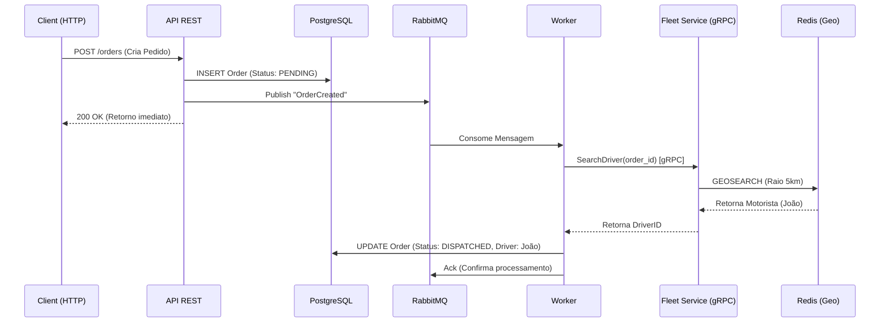

# 🚚 GoFleet

> **Sistema Distribuído de Logística e Despacho em Tempo Real**

O **GoFleet** é um backend de alta performance projetado para resolver problemas de alocação de motoristas. Ele utiliza uma arquitetura orientada a eventos para garantir que a API permaneça responsiva mesmo sob alta carga, delegando o processamento pesado para workers assíncronos e serviços especializados.

## 🏗️ Arquitetura do Sistema

O sistema é composto por três aplicações distintas que operam em conjunto:

1. **API (REST):** Recebe pedidos e consulta status.
2. **Worker (Background):** Consome eventos, processa regras de negócio e atualiza o banco.
3. **Fleet Service (gRPC):** Microsserviço especializado em Geo-localização de alta velocidade.

### Fluxo de Dados (Life Cycle)



## 🛠️ Tech Stack

* **Core:** Golang 1.22+
* **Comunicação Externa:** REST (Chi Router)
* **Comunicação Interna:** gRPC + Protobuf
* **Mensageria:** RabbitMQ (Event-Driven)
* **Banco de Dados:** PostgreSQL 15 (Persistência Principal)
* **Data Access:** SQLC (Type-safe SQL)
* **Cache & Geo:** Redis 7 (GeoSpatial Index)
* **Infra:** Docker & Docker Compose

## 🚀 Como Rodar o Projeto

### Pré-requisitos

* Docker e Docker Compose instalados.
* Go 1.22+ instalado.
* Ferramenta `migrate` (opcional, mas recomendado) ou `sqlc` se for alterar queries.

### 1. Subir Infraestrutura

Na raiz do projeto:

```bash
docker-compose up -d

```

Isso iniciará: PostgreSQL, RabbitMQ e Redis.

### 2. Configurar Banco de Dados

Se for a primeira vez, crie as tabelas:

```bash
# Opção A: Copiar o SQL manual
docker exec -it gofleet_db psql -U root -d gofleet -f /sql/migrations/000001_init.up.sql
docker exec -it gofleet_db psql -U root -d gofleet -f /sql/migrations/000002_add_status.up.sql

# Opção B: Usando golang-migrate (Se instalado)
make migrateup

```

### 3. Executar os Serviços

Você precisará de **3 terminais** abertos para rodar o ecossistema completo:

**Terminal 1: Fleet Service (gRPC + Redis)**
Este serviço popula o Redis com dados falsos de motoristas ao iniciar.

```bash
go run cmd/fleet/main.go

```

**Terminal 2: Worker (RabbitMQ Consumer)**
Fica ouvindo a fila para processar novos pedidos.

```bash
go run cmd/worker/main.go

```

**Terminal 3: API (REST Server)**
Recebe as requisições do usuário.

```bash
go run cmd/api/main.go

```

## 🔌 Utilizando a API

### 1. Criar um Pedido

A API apenas aceita o pedido e responde rápido. O processamento é assíncrono.

```bash
curl -X POST http://localhost:8000/api/v1/orders \
     -H "Content-Type: application/json" \
     -d '{
        "id": "pedido-sp-01",
        "price": 150.00,
        "tax": 10.0
     }'

```

### 2. Verificar Resultado

Consulte o banco ou logs do Worker para ver a mágica acontecer. O pedido deve passar de `PENDING` para `DISPATCHED` automaticamente.

```bash
# Via Banco de Dados
docker exec -it gofleet_db psql -U root -d gofleet -c "SELECT * FROM orders WHERE id='pedido-sp-01';"

```

*Resultado esperado:* `status: DISPATCHED`, `driver_id: Joao-da-Silva`.

## 📂 Estrutura do Projeto (Clean Architecture)

```text
.
├── cmd/                # Entrypoints (Main)
│   ├── api/            # API Rest
│   ├── fleet/          # Servidor gRPC de Frotas
│   └── worker/         # Processador de Background
├── internal/
│   ├── domain/         # Entidades e Regras de Negócio (Puro)
│   ├── application/    # UseCases e Interfaces (Ports)
│   └── infra/          # Implementações (DB, Web, Rabbit, gRPC)
│       ├── database/   # Código gerado pelo SQLC
│       ├── grpc/       # Implementação do Server e Client gRPC
│       └── web/        # Handlers HTTP
├── pkg/                # Código compartilhado (Events, Utils)
├── sql/                # Queries e Migrations
└── configs/            # Configuração via Viper (.env)

```

## 🧠 Decisões Arquiteturais

1. **Redis para Geolocalização:** Utilizamos `GEOSEARCH` do Redis em vez de calcular distâncias no PostgreSQL (PostGIS) ou em memória no Go. Isso garante latência de sub-milissegundos na busca de motoristas e torna o serviço de frota *stateless*.
2. **Worker Pattern:** A criação do pedido é desacoplada da busca por motoristas. Se o serviço de mapas cair, o pedido é salvo e processado depois (Resiliência).
3. **SQLC:** Optamos por não usar ORM (GORM) para ter controle total das queries e performance máxima no acesso ao PostgreSQL.
4. **gRPC:** Comunicação binária entre Worker e Fleet Service para economizar banda e tempo de CPU em alto tráfego.

## 📝 Próximos Passos (Roadmap)

* [ ] Implementar Graceful Shutdown em todos os serviços.
* [ ] Adicionar Tracing Distribuído (OpenTelemetry) para ver a requisição passando por API -> Rabbit -> Worker -> gRPC.
* [ ] Criar Dockerfile Multistage para deploy em Kubernetes.

---

Desenvolvido como estudo avançado de Go.