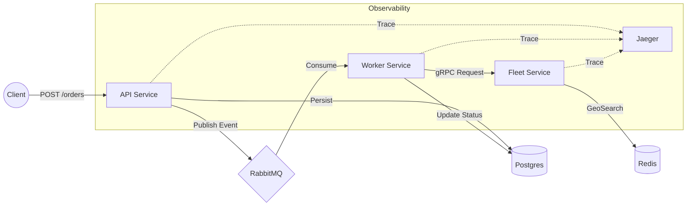

# 🚚 GoFleet

> **Sistema Distribuído de Logística e Despacho em Tempo Real**


O **GoFleet** é um backend de alta performance projetado para resolver problemas de alocação de motoristas. Ele utiliza uma arquitetura orientada a eventos para garantir que a API permaneça responsiva mesmo sob alta carga, delegando o processamento pesado para workers assíncronos e serviços especializados.

## 🏗️ Arquitetura do Sistema

O sistema é composto por três aplicações distintas que operam em conjunto:

1. **API (REST):** Recebe pedidos e consulta status.
2. **Worker (Background):** Consome eventos, processa regras de negócio e atualiza o banco.
3. **Fleet Service (gRPC):** Microsserviço especializado em Geo-localização de alta velocidade.

### Fluxo de Dados (Life Cycle)



## 🛠️ Tech Stack

* **Core:** Golang 1.22+
* **Comunicação Externa:** REST (Chi Router)
* **Comunicação Interna:** gRPC + Protobuf
* **Mensageria:** RabbitMQ (Event-Driven)
* **Banco de Dados:** PostgreSQL 18 (Persistência Principal)
* **Data Access:** SQLC (Type-safe SQL)
* **Cache & Geo:** Redis 7 (GeoSpatial Index)
* **Observabilidade:** OpenTelemetry (OTel) & Jaeger.
* **Infra:** Docker & Docker Compose

## 🚀 Como Rodar o Projeto

### Pré-requisitos

* Docker e Docker Compose instalados.
* Go 1.22+ instalado.
* Ferramenta `migrate` (opcional, mas recomendado) ou `sqlc` se for alterar queries.

### Passos

1. **Clone o repositório:**
```bash
git clone [https://github.com/diogolang/gofleet.git](https://github.com/diogolang/gofleet.git)
cd gofleet

```
2. **Suba o ambiente completo:**
```bash
make docker-up
# Ou: docker-compose up -d --build

```

*Nota: O banco de dados é inicializado automaticamente na primeira execução via script mapeado em `/docker-entrypoint-initdb.d`.*
3. **Verifique o status:**
```bash
docker ps
# Você deve ver 7 containers: api, worker, fleet, postgres, rabbitmq, redis, jaeger.

```
## 🔌 API Endpoints & Teste

### Criar Pedido

```bash
curl -X POST http://localhost:8000/api/v1/orders \
     -H "Content-Type: application/json" \
     -d '{
        "id": "pedido-demo-01",
        "price": 100.50,
        "tax": 10.0
     }'

```

**O que acontece nos bastidores:**

1. API salva como `PENDING`.
2. RabbitMQ recebe evento.
3. Worker processa e busca motorista via gRPC.
4. Worker atualiza pedido para `DISPATCHED`.

### Verificar Resultado (Banco de Dados)

```bash
docker exec -it gofleet_db psql -U root -d gofleet -c "SELECT * FROM orders WHERE id = 'pedido-demo-01';"

```

## 👁️ Observabilidade (Tracing)

O sistema implementa **Distributed Tracing** com OpenTelemetry.
Para visualizar o caminho da requisição entre os microsserviços:

1. Acesse o **Jaeger UI**: [http://localhost:16686](https://www.google.com/search?q=http://localhost:16686)
2. Em "Service", selecione `gofleet-api`.
3. Clique em **Find Traces**.
4. Você verá o gráfico completo: `API -> RabbitMQ -> Worker -> gRPC -> Redis`.

## 📂 Estrutura do Projeto (Monorepo)

```text
.
├── cmd/                # Entrypoints (Main files)
│   ├── api/            # API REST
│   ├── fleet/          # gRPC Service
│   └── worker/         # RabbitMQ Consumer
├── configs/            # Gerenciamento de env vars
├── internal/
│   ├── application/    # Casos de Uso (Use Cases)
│   ├── domain/         # Entidades e Interfaces (Core)
│   └── infra/          # Implementações (DB, Web, Event, gRPC)
├── pkg/                # Códigos compartilhados (OTel, Utils)
├── sql/                # Migrations e Queries
└── docker-compose.yaml # Orquestração

```

## 📜 Desenvolvimento Local

Se você quiser rodar os serviços Go fora do Docker (para debug na IDE):

1. Suba apenas a infraestrutura:
```bash
docker-compose up -d postgres rabbitmq redis jaeger

```

2. Execute os serviços (em terminais separados):
```bash
make run-fleet
make run-api
make run-worker

```

## 🧠 Decisões Arquiteturais

1. **Redis para Geolocalização:** Utilizamos `GEOSEARCH` do Redis em vez de calcular distâncias no PostgreSQL (PostGIS) ou em memória no Go. Isso garante latência de sub-milissegundos na busca de motoristas e torna o serviço de frota *stateless*.
2. **Worker Pattern:** A criação do pedido é desacoplada da busca por motoristas. Se o serviço de mapas cair, o pedido é salvo e processado depois (Resiliência).
3. **SQLC:** Optamos por não usar ORM (GORM) para ter controle total das queries e performance máxima no acesso ao PostgreSQL.
4. **gRPC:** Comunicação binária entre Worker e Fleet Service para economizar banda e tempo de CPU em alto tráfego.

## 📝 Próximos Passos (Roadmap)

* [ ] Implementar Graceful Shutdown em todos os serviços.
* [ ] Adicionar Tracing Distribuído (OpenTelemetry) para ver a requisição passando por API -> Rabbit -> Worker -> gRPC.
* [ ] Criar Dockerfile Multistage para deploy em Kubernetes.
---

Desenvolvido como estudo avançado de Go.