# 🚚 GoFleet


> **Sistema Distribuído de Logística e Despacho Cloud-Native**

O **GoFleet** é um backend de alta performance projetado como um laboratório de engenharia de software avançada. Ele simula uma plataforma de despacho de entregas (similar ao Uber/iFood), focando em **sistemas distribuídos**, **observabilidade completa** e **padrões de resiliência**.

O sistema orquestra a criação de pedidos via API REST, processamento assíncrono via filas, comunicação gRPC de baixa latência e busca geoespacial de motoristas.

---

## 🏗️ Arquitetura e Design

O sistema segue os princípios de **Clean Architecture** e **DDD**, organizado em um monorepo com três microsserviços distintos.

### 1. Visão Geral do Sistema (C4 Container Level)

Este diagrama ilustra como os serviços interagem com a infraestrutura.

```mermaid
graph TD
    User[Cliente HTTP] -->|POST /orders| API[🚢 API Service]
    
    subgraph Infrastructure
        DB[(PostgreSQL)]
        MQ[RabbitMQ]
        Redis[(Redis Geo)]
    end

    subgraph Microservices
        API -->|1. Persiste Pedido| DB
        API -->|2. Publica Evento| MQ
        
        Worker[👷 Worker Service] -->|3. Consome| MQ
        Worker -->|6. Atualiza Status| DB
        
        Fleet[📍 Fleet Service] -->|5. GeoSearch| Redis
    end

    Worker -->|4. gRPC SearchDriver| Fleet

```



### 2. Fluxo de Dados (Sequence Diagram)

O fluxo "Happy Path" de um pedido, demonstrando a natureza assíncrona e eventual do sistema.


---

## 🧩 Modelagem e Dados

### Diagrama de Máquina de Estados (Lifecycle do Pedido)

Para evitar estados inválidos e garantir a segurança das transições (ex: um pedido cancelado não pode ser entregue), utilizamos o **State Pattern**. O diagrama abaixo ilustra a máquina de estados finita implementada no domínio:


### Diagrama Entidade-Relacionamento (ER)

Para resolver o problema de escrita dual (Dual Write) em sistemas distribuídos, não publicamos mensagens diretamente na fila. Em vez disso, persistimos o evento na mesma transação do banco de dados, garantindo atomicidade.


---

## 🛡️ Engenharia de Resiliência

Este projeto implementa padrões robustos para lidar com falhas em sistemas distribuídos, localizados principalmente no `cmd/worker`.

### Estratégia de Defesa do Worker

```mermaid
graph LR
    Queue[RabbitMQ] -->|Msg| Retry[🔄 Exponential Backoff]
    Retry --> Circuit[⚡ Circuit Breaker]
    Circuit --> Handler[Process Order]
    Handler -->|gRPC Call| FleetService

    style Circuit fill:#f9f,stroke:#333,stroke-width:2px
    style Retry fill:#bbf,stroke:#333,stroke-width:2px

```



1. **Circuit Breaker (Gobreaker):**
* Protege o `Fleet Service` de ser sobrecarregado caso comece a falhar.
* Configuração: Abre o circuito após falha de 60% das requisições (min 10 requests).


2. **Exponential Backoff:**
* Se o processamento falhar (ex: erro transiente de rede), o sistema tenta novamente 3 vezes, aumentando o tempo de espera exponencialmente (1s, 2s, 4s).


3. **Dead Letter Queues (DLQ):**
* Mensagens que excedem as tentativas são enviadas para uma fila de "Wait" ou "Parking" para análise manual, garantindo que nenhum pedido seja perdido.


4. **Graceful Shutdown:**
* Todos os serviços interceptam sinais de `SIGTERM` para fechar conexões com DB e RabbitMQ e terminar requisições em andamento antes de encerrar.


---

## 👁️ Observabilidade Completa

O diferencial do GoFleet é a correlação total de dados. Um `TraceID` gerado na API viaja via headers AMQP até o Worker e via metadados gRPC até o Fleet.

### Stack de Observabilidade

* **Tracing:** OpenTelemetry (OTel) -> Jaeger.
* **Métricas:** Prometheus (exposto em `:2112/metrics`).
* **Logs:** Zap (JSON Estruturado) com injeção automática de `trace_id` e `span_id` -> Promtail -> Loki.
* **Visualização:** Grafana unificando tudo.

---

## 🛠️ Tecnologias e Bibliotecas

| Categoria          | Tecnologia            | Uso no Projeto                         |
|--------------------|-----------------------|----------------------------------------|
| **Linguagem**      | **Go 1.25**           | Core do sistema                        |
| **Framework HTTP** | **Chi v5**            | Router leve e idiomático               |
| **Comunicação**    | **gRPC + Protobuf**   | Comunicação interna (Worker -> Fleet)  |
| **Mensageria**     | **RabbitMQ**          | Desacoplamento de eventos              |
| **Database**       | **PostgreSQL + SQLC** | Persistência Type-Safe (Sem ORM)       |
| **Cache/Geo**      | **Redis**             | GeoSpatial Indexing para motoristas    |
| **Resiliência**    | **Sony Gobreaker**    | Circuit Breaker                        |
| **Config**         | **Viper**             | Gerenciamento de váriaveis de ambiente |
| **Tracing**        | **OpenTelemetry**     | Instrumentação manual e automática     |

---

## 🚀 Como Executar

### Pré-requisitos

* Docker e Docker Compose
* Make (opcional, para usar os atalhos)
* Go 1.25+ (apenas se for rodar fora do Docker)

### Passo a Passo

1. **Subir o ecossistema:**
   O comando abaixo compila os binários, constrói as imagens Docker e sobe toda a infraestrutura (Bancos, Filas e Observabilidade).
```bash
make docker-up

```


2. **Acessar os Dashboards:**
* **Grafana:** [http://localhost:3000](https://www.google.com/search?q=http://localhost:3000) (User: `admin`, Pass: `admin`)
* **Jaeger UI:** [http://localhost:16686](https://www.google.com/search?q=http://localhost:16686)
* **Prometheus:** [http://localhost:9090](https://www.google.com/search?q=http://localhost:9090)
* **RabbitMQ:** [http://localhost:15672](https://www.google.com/search?q=http://localhost:15672) (guest/guest)


3. **Realizar um Teste (Criar Pedido):**
   Utilize o arquivo `orders.http` ou via cURL:
```bash
curl -X POST http://localhost:8000/api/v1/orders \
-H "Content-Type: application/json" \
-d '{"id":"pedido-teste-01", "price": 100.0, "tax": 10.0}'

```


4. **Verificar o Fluxo:**
* Verifique se o pedido foi criado no Postgres:
```bash
docker exec -it gofleet_db psql -U root -d gofleet -c "SELECT * FROM orders;"

```


* Vá ao **Jaeger**, selecione `gofleet-api` e procure pelos traces. Você verá a linha do tempo completa: API -> RabbitMQ -> Worker -> gRPC -> Redis.


---

## 🧠 Padrões de Código (Staff Engineer View)

Explicação de decisões técnicas encontradas no código fonte:

### 1. Decorator Pattern para Métricas

Local: `internal/application/usecase/order/create_metrics.go`

* **Por quê?** Separa a lógica de negócio (Use Case) da instrumentação.
* **Como?** O `CreateOrderMetricsDecorator` "envolve" o Use Case real. Ele mede o tempo de execução e incrementa contadores no Prometheus sem sujar a regra de negócio.

### 2. State Pattern

Local: `internal/domain/entity/states.go`

* **Por quê?** Evita condicionais complexas (`if status == "PENDING"`) e garante transições seguras.
* **Como?** Cada estado (Pending, Dispatched, Delivered) é uma struct que implementa a interface `OrderState`. Tentar entregar um pedido cancelado retorna erro automaticamente.

### 3. Interface Segregation (Ports & Adapters)

Local: `internal/application/port`

* **Por quê?** O domínio não conhece o banco de dados ou gRPC.
* **Como?** Os Use Cases dependem de interfaces (`OrderRepository`, `LocationRepository`). As implementações concretas (Postgres, Redis) estão na camada de `infra`.

### 4. Propagação de Contexto (Distributed Tracing)

Local: `internal/infra/event/consumer.go`

* **Por quê?** Não perder o rastro da requisição quando ela entra na fila.
* **Como?** Extraímos o `traceparent` dos headers da mensagem AMQP e injetamos no `context.Context` do Go. Isso liga o Span do `produtor` (API) ao Span do `consumidor` (Worker).

---

## 📂 Estrutura de Pastas

```text
.
├── cmd/                # Entrypoints (main.go)
│   ├── api/            # API REST
│   ├── fleet/          # Serviço gRPC de Geolocalização
│   └── worker/         # Processador de Filas
├── configs/            # Configuração (Viper)
├── internal/
│   ├── application/    # Camada de Aplicação
│   │   ├── usecase/    # Regras de Negócio + Decorators
│   │   └── port/       # Interfaces (Ports)
│   ├── domain/         # Core (Entidades, Eventos, States)
│   └── infra/          # Adaptadores de Infraestrutura
│       ├── database/   # Implementações SQLC e Redis
│       ├── event/      # RabbitMQ (Producer/Consumer)
│       ├── grpc/       # Implementação do Server/Client gRPC
│       └── web/        # Handlers HTTP
├── pkg/                # Packages compartilhados (Logger, Metrics, OTel)
└── sql/                # Migrations e Queries SQLC

```

---

---

## 🔧 Configuração (Environment Variables)

O sistema segue a metodologia **12-Factor App**, externalizando configurações via variáveis de ambiente. Abaixo estão as principais chaves definidas em `configs/configs.go`:

| Variável                      | Descrição                 | Valor Padrão (Dev) |
|-------------------------------|---------------------------|--------------------|
| `DB_HOST`                     | Host do PostgreSQL        | `localhost`        |
| `DB_PORT`                     | Porta do Banco            | `5432`             |
| `RABBITMQ_HOST`               | Host do RabbitMQ          | `localhost`        |
| `REDIS_HOST`                  | Host do Redis             | `localhost`        |
| `OTEL_SERVICE_NAME`           | Nome do serviço no Jaeger | `gofleet-api`      |
| `OTEL_EXPORTER_OTLP_ENDPOINT` | Endpoint do Collector     | `localhost:4317`   |
| `WEB_SERVER_PORT`             | Porta da API REST         | `8000`             |
| `GRPC_PORT`                   | Porta do Servidor gRPC    | `50051`            |

> **Nota:** Para execução local, o arquivo `.env` é carregado automaticamente pelo Viper.

---

## 🧪 Comandos Úteis (Makefile)

* `make proto`: Gera o código Go a partir dos arquivos `.proto`.
* `make sqlc`: Gera o código Go a partir das queries SQL.
* `make new-migration name=create_orders`: Cria novo arquivo de migration.
* `make test`: Roda testes unitários.
* `make run-api`: Roda a API localmente (requer DB/Rabbit rodando).

---

## 🔮 Roadmap e Melhorias Futuras

Este projeto é um laboratório vivo. Os próximos passos para atingir o nível "Production Ready" incluem:

* [ ] **Segurança:** Implementar Autenticação/Autorização (OAuth2/OIDC) com Keycloak.
* [ ] **CI/CD:** Pipeline de Github Actions para testes, linter (golangci-lint) e build de imagem.
* [ ] **Kubernetes:** Criar Helm Charts para deploy orquestrado (com HPA configurado nas métricas de CPU/RabbitMQ).
* [ ] **Testes de Carga:** Script k6 para validar o comportamento do Circuit Breaker sob stress.
* [ ] **Idempotência:** Garantir que o processamento de eventos seja idempotente utilizando Redis para dedup de chaves.

---

**Autoria:** Desenvolvido como referência para arquiteturas Go Modernas.