# 🚚 GoFleet


> **Sistema Distribuído de Logística e Despacho Cloud-Native**

O **GoFleet** é um backend de alta performance projetado como um laboratório de engenharia de software avançada. Ele simula uma plataforma de despacho de entregas (similar ao Uber/iFood), focando em **sistemas distribuídos**, **observabilidade completa** e **padrões de resiliência**.

O sistema orquestra a criação de pedidos via API REST, processamento assíncrono via filas, comunicação gRPC de baixa latência e busca geoespacial de motoristas.

---

## 🏗️ Arquitetura e Design

O sistema segue os princípios de **Clean Architecture** e **DDD**, organizado em um monorepo com três microsserviços distintos.

### 1. Visão Geral do Sistema (C4 Container Level)

Este diagrama ilustra como os serviços interagem com a infraestrutura.

```mermaid
graph TD
    User[Cliente HTTP] -->|POST /orders| API[🚢 API Service]

subgraph Infrastructure
DB[(PostgreSQL)]
MQ[RabbitMQ]
Redis[(Redis Cache/Geo)]
end

subgraph Microservices
API -->|1. Persiste Pedido| DB
API -->|2. Publica Evento| MQ

Worker[👷 Worker Service] -->|3. Consome| MQ
Worker -->|4. Check Idempotência| Redis
Worker -->|7. Atualiza Status| DB

Fleet[📍 Fleet Service] -->|6. GeoSearch| Redis
end

Worker -->|5. gRPC SearchDriver| Fleet

```



### 2. Fluxo de Dados (Sequence Diagram)

O fluxo "Happy Path" de um pedido, demonstrando a natureza assíncrona e eventual do sistema.

```mermaid
sequenceDiagram
    participant User
    participant API
    participant DB
    participant RabbitMQ
    participant Worker
    participant Fleet
    participant Redis

    User->>API: POST /api/v1/orders
    activate API
    API->>DB: Transaction: INSERT Order (PENDING) + INSERT Outbox
    API-->>User: 201 Created (Order ID)
    deactivate API

    Note over API,RabbitMQ: Outbox Relay (Background Process)
    API->>DB: Fetch Pending (SKIP LOCKED)
    API->>RabbitMQ: Publish (orders.created)
    API->>DB: Mark as Published

    Note over RabbitMQ,Worker: Processamento Assíncrono

    RabbitMQ->>Worker: Consume Message
    activate Worker
    Worker->>Worker: Extract Tracing Context
    Worker->>Redis: Check Idempotency (SETNX)

    alt Nova Mensagem (Lock Adquirido)
        Worker->>Fleet: gRPC SearchDriver(OrderID)
        activate Fleet
        Fleet->>Redis: GEOSEARCH (Radius 5km)
        Redis-->>Fleet: Driver Found
        Fleet-->>Worker: Driver Details
        deactivate Fleet

        Worker->>DB: UPDATE Order (DISPATCHED)
        Worker-->>RabbitMQ: ACK
    else Mensagem Duplicada
        Worker-->>RabbitMQ: ACK (Descarte Silencioso)
    end
    deactivate Worker

```



---

## 🧩 Modelagem e Dados

Além da infraestrutura, o GoFleet utiliza modelagem rica para garantir a integridade das regras de negócio e a consistência dos dados distribuídos.

### Ciclo de Vida do Pedido (State Machine)

O domínio garante transições válidas via **State**, enquanto o banco de dados atua como última linha de defesa através de **CHECK constraints**, evitando estados inválidos mesmo em cenários de falha.”

Para evitar estados inválidos e garantir a segurança das transições (ex: um pedido cancelado não pode ser entregue), utilizamos o **State Pattern**. O diagrama abaixo ilustra a máquina de estados finita implementada no domínio:


### Consistência Eventual (Transactional Outbox)

Para resolver o problema de escrita dual (Dual Write) em sistemas distribuídos, não publicamos mensagens diretamente na fila. Em vez disso, persistimos o evento na mesma transação do banco de dados, garantindo atomicidade.


### 3. Controle de Concorrência e Integridade do Aggregate

Em um ambiente de alta escala, múltiplos processos podem tentar modificar o mesmo Aggregate (Pedido) simultaneamente (ex: um evento de "Cancelar" compete com um de "Despachar").

O sistema garante a consistência através de:

1.  **State Pattern como Guardião:**
    A lógica de domínio em memória atua como primeira barreira. Se um Worker carregar um pedido que já está `CANCELLED` e tentar executar `Dispatch()`, a Entidade retorna erro de regra de negócio imediatamente, abortando a transação antes da escrita.

2.  **Transações ACID:**
    Todas as mutações de estado e persistência de eventos (Outbox) ocorrem dentro de uma transação isolada do PostgreSQL, garantindo que a visão do agregado seja consistente durante a operação.

---

## 🛡️ Engenharia de Resiliência e Confiabilidade

O GoFleet implementa uma estratégia de defesa em profundidade (*Defense in Depth*) no `Worker Service`, combinando padrões para garantir consistência e alta disponibilidade.

### Pipeline de Processamento (Middleware Chain)

O diagrama abaixo ilustra a ordem exata das camadas de proteção aplicadas a cada mensagem recebida

```mermaid
flowchart TD
   Queue[RabbitMQ] --> Backoff[1️⃣ Exponential Backoff]
   Backoff --> Idemp{2️⃣ Redis Idempotency}

   Idemp -- Key Exists --> AckDiscard[🗑️ Discard & ACK]
Idemp -- New Key --> CB{3️⃣ Circuit Breaker}

CB -- Closed (OK) --> Grpc[🚀 Call Fleet Service]
CB -- Open (Fail) --> Fallback[🛡️ Execute Fallback]

Grpc --> Success[✅ Update DB: DISPATCHED]
Fallback --> Manual[⚠️ Update DB: MANUAL_DISPATCH]


```



### 1. Idempotência (Deduplicação com Decorator)

Implementamos um **Idempotency Guard** usando o padrão Decorator.

* **Estratégia:** Prioriza o cabeçalho `x-event-id` (vindo do Outbox) como chave única.
* **Mecanismo:** Usa `Redis SETNX` para obter um lock atômico com TTL de 24h.
* **Segurança (Fail-Closed):** Se o Redis estiver indisponível, o worker rejeita a mensagem (Nack) preventivamente para evitar processamento duplicado acidental.

### 2. Fallback e Degradação Graciosa

Se o `Fleet Service` cair, o pedido não fica preso em loops infinitos. O sistema captura o erro do Circuit Breaker e move o pedido para o estado `MANUAL_DISPATCH`, permitindo que a operação continue manualmente.

### 3. Backpressure e Controle de Carga

Para evitar exaustão de memória (OOM) sob picos de tráfego:

* **Worker Pool:** Concorrência controlada via número fixo de Goroutines (ex: 10 workers).
* **Prefetch Count (QoS):** O RabbitMQ só envia mensagens se o Worker tiver capacidade (`WorkerCount * 2`), garantindo que a aplicação nunca aceite mais trabalho do que pode processar.

---

### 1. Idempotência (Deduplicação com Decorator)

Implementamos um **Idempotency Guard** usando o padrão Decorator.

* **Estratégia:** Prioriza o cabeçalho `x-event-id` (vindo do Outbox) como chave única.
* **Mecanismo:** Usa `Redis SETNX` para obter um lock atômico com TTL de 24h.
* **Segurança (Fail-Closed):** Se o Redis estiver indisponível, o worker rejeita a mensagem (Nack) preventivamente para evitar processamento duplicado acidental.

### 2. Fallback e Degradação Graciosa

Se o `Fleet Service` cair, o pedido não fica preso em loops infinitos. O sistema captura o erro do Circuit Breaker e move o pedido para o estado `MANUAL_DISPATCH`, permitindo que a operação continue manualmente.

### 3. Backpressure e Controle de Carga

Para evitar exaustão de memória (OOM) sob picos de tráfego:

* **Worker Pool:** Concorrência controlada via número fixo de Goroutines (ex: 10 workers).
* **Prefetch Count (QoS):** O RabbitMQ só envia mensagens se o Worker tiver capacidade (`WorkerCount * 2`), garantindo que a aplicação nunca aceite mais trabalho do que pode processar.


### 4. Semântica de Entrega (At-Least-Once Delivery)

O sistema foi desenhado assumindo que **falhas ocorrerão** após o processamento mas antes da confirmação (ACK).

| Cenário de Falha                                | Comportamento do Sistema                                                                                                                                                                |
|:------------------------------------------------|:----------------------------------------------------------------------------------------------------------------------------------------------------------------------------------------|
| **Worker cai antes do DB Commit**               | RabbitMQ reenvia a mensagem. O novo Worker processa normalmente.                                                                                                                        |
| **Worker cai APÓS DB Commit, mas ANTES do ACK** | RabbitMQ reenvia a mensagem (At-Least-Once). O novo Worker tenta processar, mas é **bloqueado pelo Redis (Idempotency)** ou pela **Unique Constraint** do banco, enviando apenas o ACK. |

> **Garantia Final:** Nenhuma transição de estado ocorre mais de uma vez, mesmo sob falhas catastróficas do processo.


### 5. Backpressure e Controle de Carga

Para evitar que picos de tráfego derrubem os Workers por exaustão de memória (OOM), implementamos um mecanismo estrito de **Backpressure** direto no protocolo AMQP.

* **Prefetch Count (QoS):**
  O Worker limita a ingestão a **10 mensagens simultâneas** por instância.
   * *Como funciona:* O RabbitMQ cessa o envio de novas mensagens até que o Worker libere slots enviando `ACKs`.
   * *Resultado:* O sistema torna-se "elástico". Se o banco de dados ficar lento, o Worker processa mais devagar, o RabbitMQ segura as mensagens na fila, e a API continua aceitando pedidos sem cair.

---

## 👁️ Observabilidade Completa

O diferencial do GoFleet é a correlação total de dados. Um `TraceID` gerado na API viaja via headers AMQP até o Worker e via metadados gRPC até o Fleet.

### Stack de Observabilidade

* **Tracing:** OpenTelemetry (OTel) -> Jaeger.
* **Métricas:** Prometheus (exposto em `:2112/metrics`).
* **Logs:** Zap (JSON Estruturado) com injeção automática de `trace_id` e `span_id` -> Promtail -> Loki.
* **Visualização:** Grafana unificando tudo.

---

## 🛠️ Tecnologias e Bibliotecas

| Categoria          | Tecnologia            | Uso no Projeto                         |
|--------------------|-----------------------|----------------------------------------|
| **Linguagem**      | **Go 1.25**           | Core do sistema                        |
| **Framework HTTP** | **Chi v5**            | Router leve e idiomático               |
| **Comunicação**    | **gRPC + Protobuf**   | Comunicação interna (Worker -> Fleet)  |
| **Mensageria**     | **RabbitMQ**          | Desacoplamento de eventos              |
| **Database**       | **PostgreSQL + SQLC** | Persistência Type-Safe (Sem ORM)       |
| **Cache/Geo**      | **Redis**             | GeoSpatial Indexing para motoristas    |
| **Resiliência**    | **Sony Gobreaker**    | Circuit Breaker                        |
| **Config**         | **Viper**             | Gerenciamento de váriaveis de ambiente |
| **Tracing**        | **OpenTelemetry**     | Instrumentação manual e automática     |

---

---

## 📈 Service Level Objectives (SLOs)

Mais do que apenas coletar métricas, o GoFleet define objetivos claros de confiabilidade e performance que justificam as decisões arquiteturais (ex: uso de filas e circuit breakers).

| Serviço            | Indicador (SLI)                   | Objetivo (SLO) | Racional                                                                                              |
|:-------------------|:----------------------------------|:---------------|:------------------------------------------------------------------------------------------------------|
| **API Service**    | Latência de Ingestão (p95)        | **< 200ms**    | O cliente não deve esperar para "criar" o pedido. A complexidade pesada é delegada ao Worker.         |
| **API Service**    | Disponibilidade                   | **99.9%**      | A API deve aceitar pedidos mesmo se o RabbitMQ ou Fleet Service estiverem fora (fallback via Outbox). |
| **Worker Service** | Latência E2E (Create -> Dispatch) | **< 5s**       | Tempo máximo aceitável para o motorista ser alocado após o clique do usuário.                         |
| **Worker Service** | Taxa de Sucesso                   | **> 99.5%**    | Permite falhas transientes (retries), mas alerta se o Circuit Breaker abrir por muito tempo.          |

> **Nota:** Os dashboards do Grafana foram desenhados para monitorar a "saúde" desses SLOs, e não apenas consumo de CPU/Memória.

---

## 🚀 Como Executar

### Pré-requisitos

* Docker e Docker Compose
* Make (opcional, para usar os atalhos)
* Go 1.25+ (apenas se for rodar fora do Docker)

### Passo a Passo

1. **Subir o ecossistema:**
   O comando abaixo compila os binários, constrói as imagens Docker e sobe toda a infraestrutura (Bancos, Filas e Observabilidade).
```bash
make docker-up

```


2. **Acessar os Dashboards:**
* **Grafana:** [http://localhost:3000](https://www.google.com/search?q=http://localhost:3000) (User: `admin`, Pass: `admin`)
* **Jaeger UI:** [http://localhost:16686](https://www.google.com/search?q=http://localhost:16686)
* **Prometheus:** [http://localhost:9090](https://www.google.com/search?q=http://localhost:9090)
* **RabbitMQ:** [http://localhost:15672](https://www.google.com/search?q=http://localhost:15672) (guest/guest)


3. **Realizar um Teste (Criar Pedido):**
   Utilize o arquivo `orders.http` ou via cURL:
```bash
curl -X POST http://localhost:8000/api/v1/orders \
-H "Content-Type: application/json" \
-d '{"id":"pedido-teste-01", "price": 100.0, "tax": 10.0}'

```


4. **Verificar o Fluxo:**
* Verifique se o pedido foi criado no Postgres:
```bash
docker exec -it gofleet_db psql -U root -d gofleet -c "SELECT * FROM orders;"

```


* Vá ao **Jaeger**, selecione `gofleet-api` e procure pelos traces. Você verá a linha do tempo completa: API -> RabbitMQ -> Worker -> gRPC -> Redis.


---

## 🧠 Padrões de Código (Staff Engineer View)

Decisões técnicas de alto nível implementadas no código para garantir manutenibilidade e escala:

### 1. Idempotency Decorator (Middleware)

* **Local:** `pkg/event/middleware.go`
* **Conceito:** Separação total entre infraestrutura (Redis) e regra de negócio. O Handler não sabe que está sendo deduplicado. Isso facilita testes unitários (basta mockar a interface `RedisIdempotencyStore`) e mantém o princípio de Responsabilidade Única (SRP).

### 2. Database Locking Strategy (Outbox)

* **Local:** `internal/infra/database/queries/outbox.sql`
* **Conceito:** Uso de `FOR UPDATE SKIP LOCKED` no Postgres.
* **Por quê?** Permite escalar o *Outbox Relay* horizontalmente (múltiplas réplicas da API) sem gerar *Race Conditions*. Cada instância pega um lote único de eventos para despachar.

### 3. Worker Pool & Graceful Shutdown

* **Local:** `internal/infra/event/consumer.go`
* **Conceito:** Uso de `sync.WaitGroup` e canais de sinalização. Quando o Kubernetes envia um `SIGTERM`, o serviço para de aceitar novas mensagens, mas aguarda os workers terminarem o processamento atual antes de desligar, evitando perda de dados em memória.

### 4. Propagação de Contexto (Tracing)

* **Local:** `internal/infra/event/consumer.go`
* **Conceito:** Extração manual do header `traceparent` do AMQP e injeção no `context.Context` do Go. Isso garante que o Trace ID gerado na API HTTP apareça nos logs do Worker e nas chamadas ao Redis.

---

## 📂 Estrutura de Pastas

```text
.
├── cmd/                # Entrypoints (main.go)
│   ├── api/            # API REST
│   ├── fleet/          # Serviço gRPC de Geolocalização
│   └── worker/         # Processador de Filas
├── configs/            # Configuração (Viper)
├── internal/
│   ├── application/    # Camada de Aplicação
│   │   ├── usecase/    # Regras de Negócio + Decorators
│   │   └── port/       # Interfaces (Ports)
│   ├── domain/         # Core (Entidades, Eventos, States)
│   └── infra/          # Adaptadores de Infraestrutura
│       ├── database/   # Implementações SQLC e Redis
│       ├── event/      # RabbitMQ (Producer/Consumer)
│       ├── grpc/       # Implementação do Server/Client gRPC
│       └── web/        # Handlers HTTP
├── pkg/                # Packages compartilhados (Logger, Metrics, OTel)
└── sql/                # Migrations e Queries SQLC

```

---

---

## 🔧 Configuração (Environment Variables)

O sistema segue a metodologia **12-Factor App**, externalizando configurações via variáveis de ambiente. Abaixo estão as principais chaves definidas em `configs/configs.go`:

| Variável                      | Descrição                 | Valor Padrão (Dev) |
|-------------------------------|---------------------------|--------------------|
| `DB_HOST`                     | Host do PostgreSQL        | `localhost`        |
| `DB_PORT`                     | Porta do Banco            | `5432`             |
| `RABBITMQ_HOST`               | Host do RabbitMQ          | `localhost`        |
| `REDIS_HOST`                  | Host do Redis             | `localhost`        |
| `OTEL_SERVICE_NAME`           | Nome do serviço no Jaeger | `gofleet-api`      |
| `OTEL_EXPORTER_OTLP_ENDPOINT` | Endpoint do Collector     | `localhost:4317`   |
| `WEB_SERVER_PORT`             | Porta da API REST         | `8000`             |
| `GRPC_PORT`                   | Porta do Servidor gRPC    | `50051`            |

> **Nota:** Para execução local, o arquivo `.env` é carregado automaticamente pelo Viper.

---

## 🧪 Comandos Úteis (Makefile)

* `make proto`: Gera o código Go a partir dos arquivos `.proto`.
* `make sqlc`: Gera o código Go a partir das queries SQL.
* `make new-migration name=create_orders`: Cria novo arquivo de migration.
* `make test`: Roda testes unitários.
* `make run-api`: Roda a API localmente (requer DB/Rabbit rodando).

---

## 🔮 Roadmap e Melhorias Futuras

Este projeto é um laboratório vivo. Os próximos passos para atingir o nível "Production Ready" incluem:

## 🔮 Roadmap

* [x] **Idempotência:** Implementada com Redis (`SETNX`) e padrão Decorator.
* [x] **Resiliência:** Circuit Breaker, Retries e Fallback Strategy implementados.
* [x] **Observabilidade:** Rastreamento distribuído (OTel) conectado entre microserviços.
* [ ] **Segurança:** Implementar Autenticação (OAuth2/OIDC) com Keycloak.
* [ ] **CI/CD:** Pipeline de Github Actions para lint, test e build.
* [ ] **Kubernetes:** Helm Charts para deploy orquestrado (HPA).
* [ ] **Testes de Carga:** Script k6 para validar o Circuit Breaker sob stress.
---

**Autoria:** Desenvolvido como referência para arquiteturas Go Modernas.